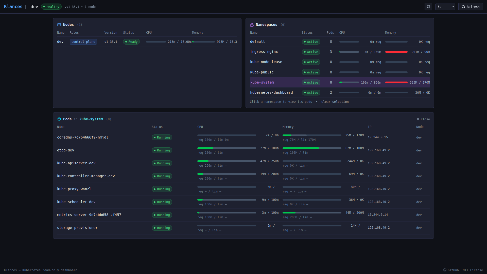

[](https://artifacthub.io/packages/helm/klances/klances)

[](https://github.com/sponsors/nicolargo)

## What is Klances?

A *read-only* WebUI dashboard for Kubernetes cluster monitoring. Designed for end-users unfamiliar with Kubernetes and for cluster admins who want a quick status overview. Also exposes a fully functional REST API for integration with other tools.

What's displayed by Klances:

- Cluster status (overall health, version)
- Node list (roles, version, CPU, Memory)
- Namespace list (status, CPU, Memory, Pod count)
- Pod list for each namespace (status, CPU, Memory with current/requested/limit)
- Pod details — services/ingress, events, logs

<p align="center">
  
</p>

## Requirements

- Python ≥ 3.10
- Node.js ≥ 18
- A Kubernetes cluster reachable via `~/.kube/config` (local dev) or in-cluster service account (production)

## Development setup

```bash
# 1. Install all dependencies (backend + frontend) — first time only
make install

# 2. Start the development server
make run
```

This single command:
- Builds the Vue.js frontend once
- Watches `src/frontend/src/` for changes and rebuilds automatically
- Starts the FastAPI server with auto-reload on port 8000

Open **http://localhost:8000/frontend/** in your browser.

API interactive docs are available at **http://localhost:8000/api/1/docs**.

## Production

```bash
make build   # compile the frontend into src/frontend/dist/
klances      # start the production server
```

The `klances` command accepts options:

```bash
klances                      # defaults: 0.0.0.0:8000, 1 worker
klances --port 9000          # custom port
klances --workers 4          # multi-process
klances --host 127.0.0.1     # bind to localhost only
```

In a Kubernetes cluster, Klances automatically uses the in-cluster service account.
If no cluster configuration is available, Klances starts gracefully and displays a
"cluster unreachable" message in the WebUI until a connection is established.

## Available commands

```
make install    Install all dependencies (backend + frontend)
make run        Start the development server on port 8000
make build      Build the frontend for production
make test       Run all backend tests (pytest)
make test-one   Run a single test file (TEST=tests/test_cluster.py)
make lint       Lint with ruff
make format     Format with ruff
make clean      Remove virtualenv, caches and frontend build
```

## URL structure

| Path | Description |
|------|-------------|
| `/frontend/` | Vue.js WebUI dashboard |
| `/api/1/docs` | Interactive REST API documentation |
| `/api/1/status` | API health check |
| `/api/1/cluster` | Cluster info and status |
| `/api/1/nodes` | Node list with resources |
| `/api/1/namespaces` | Namespace list with aggregated resources |
| `/api/1/namespaces/{ns}/pods` | Pod list for a namespace |
| `/api/1/namespaces/{ns}/pods/{pod}` | Pod details (services, ingresses, events, logs) |

## Installation via Helm

```bash
helm repo add klances https://nicolargo.github.io/klances
helm repo update
helm install klances klances/klances
```

Pour plus d'options, consulte la [documentation du chart](./charts/klances/README.md).

A GitHub Actions pipeline (`.github/workflows/helm-release.yml`) automatically packages and publishes the chart on every push to `main` that modifies `charts/**`. Before the first run, the `gh-pages` branch must exist:

```bash
git checkout --orphan gh-pages
git rm -rf .
git commit --allow-empty -m "Init gh-pages"
git push origin gh-pages
```

## License

Klances is licensed under the MIT License. See the LICENSE file for more details.
